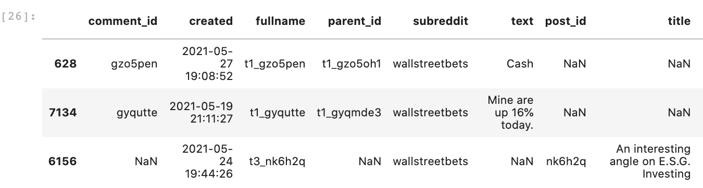
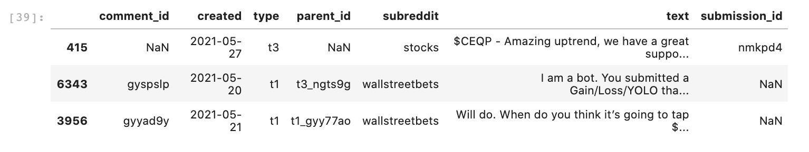
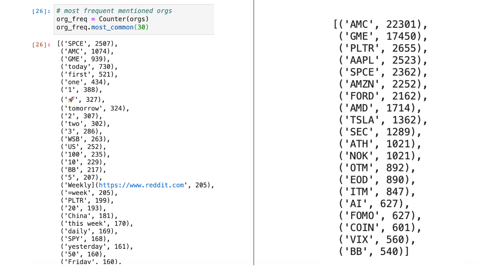
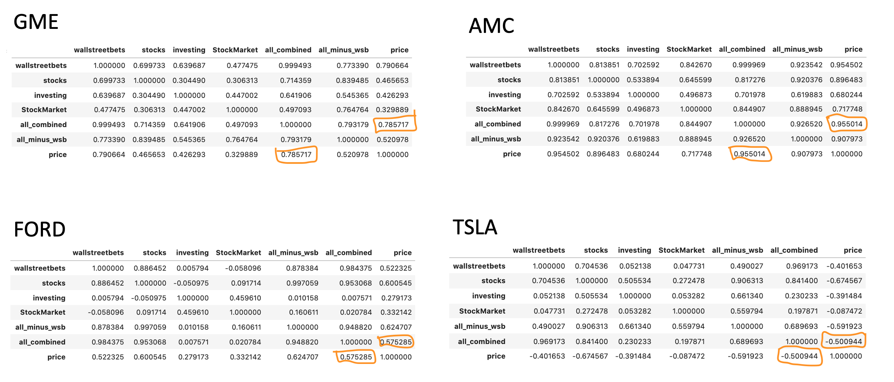
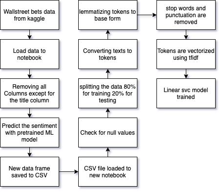
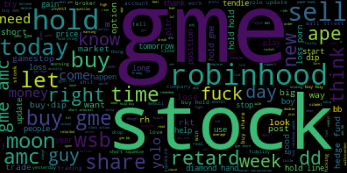
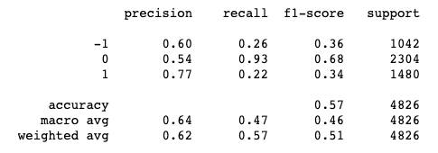
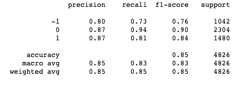
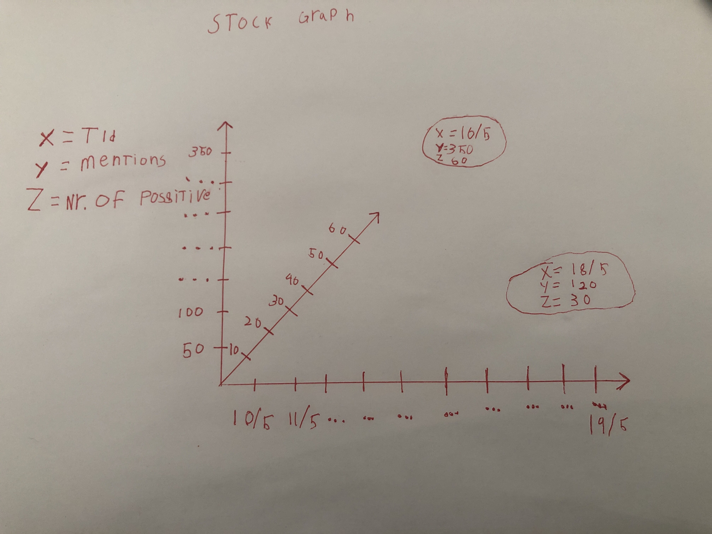

[Assignment description](https://github.com/datsoftlyngby/soft2021spring-ds/blob/main/BigProject.pdf)

*CPH Business Spring 2021*, *Sebastian Harvej* & *Malene Hansen*

# Stocks: Hype vs Market

## Stage 1: Business Case Foundation

In recent years investing has grown popular among young people. They are known to be risk seeking and to gain and share knowledge and tips online.

It seems to be common knowledge that a stock can be hyped. Meaning that the price on a stock can go up solely (or mainly) because of hype. 

We have recently seen how these investors could cause a stock to go up, against any logic, when a group of people on the social media platform Reddit decided to buy GameStop shares, for the sake of punishing hedge funds, causing the stock to skyrocket.

This is an extra ordinary example, but it makes us wonder if smaller scaled hype actually has an effect on stock prices. And if so; is that something we can predict?

### Focus of interest
Our focus is to detect **hype on social media** and to **compare it to stock prices**.

As our social media source for this prototype we use the online forum reddit.com, as they are known to be a popular place to discuss investing. And equally important; reddit.com provides an extensive API to access data from their website.

The correlation between hype and stock prices is interesting to investigate, not only because it might reveal a whole new dimension to stock trading evolving around social media. And posibly the overall availability of knowledge sharing made possible by the www and maybe even more by social media entering the scene. But also because that revealing a correlation also opens up for the possibility of predicting stock priceses.

### Hyphothesis

#### Null Hypotheses
Stock prices can not be affected by hype on social media.

#### Alternative Hypotheses
There is a correlation between stock prices and hype on social media.

### Expected outcome of research
We expect to see some correlation between at least some stocks going up and how much they are mentioned/discussed on social media. 

### Who will be the user of the results
Knowledge is money. We our selves will be the users of the results and hopefully we'll discover something new and exiting. Because the we will then be on the path to becoming very rich.

## Stage 2: Business Data Storytelling

### Data Sources

#### Yahoo Finance

We get stock prices using Yajoo finance to price data for stocks, we are then cleaning the close price for null vales by giving them the value of the the day before, the date and close price of the stock is saved to a database.!

#### Reddit.com

We are collecting post and comments from the following subreddit forums:

  - r/wallstreetbets (10.1 million users)
  - r/Stocks (2.6 million users)
  - r/Investing (1.8 million users)
  - r/pennystocks (1.6 million users)
  - r/StockMarket (1.5 million users)
  - r/algotrading (1.2 million users)
  - r/Robinhood (742.000 users)
 

  
  *The subreddit "wallstreetbets" became world famous following the gamestop surge initiated by its users. With the fame it grew tremendously and counts more than 10 million users as of today. The jargon is juvenile and rebellious and it has become infamous for encouraging aggressive trading strategies.
  The other subreddits consider seem to consider themselves to be of a "more serious" character than wallstreet bets. 
  All subreddits were chosen because they discuss investing and hold a great amount of users.*

We have collected the data over a period of 10 days and saved it in batches into csv files.

#### Our Reddit data sets can be found [here](/Data_Collecting/data_files/all_data_streams/)
  
#### Our scripts for collecting the  Reddit data can be found [here](/Data_Collecting/)

### Data Processing
 
 
We have collected the following data from reddit:

#### Cleaning the reddit data:

The first two characters in the fullname values can be used to identify comments (t1) and submissions (t3). We rename the label to 'type' and save the first two characters of the values as values.

The columns labeled 'title' and 'Unnamed: 0.1' are dropped, as we aren't going to use them.

The 'post_id' label is renamed to 'submission_id' to prevent confusion later in the process, as a forum post on reddit is called a submission.
 
 

 

#### Identifying stocks
 
To detect hyped stocks we use Named Entity Recognition (NER), a Natural Language Processing technique, to interpret our data.
We apply it to every comment and submission in our data set by using a python library called spaCy, which has a pretrained pipeline for english "web text" that we can apply.

We filter the entities found for the ones labeled "ORG". A lot of stocks are found, but also a lot of excess organizations, web adresses and even the rocket emoji. We filter them out by creating a list ("BLACKLIST") with the organizations we want to skip.

#### Our notebook where we identify stock mentions with NER can be found here [here](/Data_Processing/NER.ipynb)

Organizations are identified both with their ticker and their company name. We therefore concat those, that are representet in the top most frequently mentioned, to get an overview of which stocks get mentioned most and therefore provide us with the most data for further work on our prototype.

We pick to 20 most mentioned stocks for further processing/analysing.

#### Our notbook where we clean Reddit data and add stock mentions can be found [here](/Data_Processing/Clean.ipynb)

### Exploring data

With the stock mentions identified we can take a look at how they compare to the stock prices. We compare mentions to prices on each subreddit, as well as the subreddits that are NOT wallstreetbets, as we have experienced that some times mentions from wallstreetbets are very far from comparable to the rest of the subreddits. For this purpose though, we only relate to the total amount of mentions across all subreddits. These are the four with the highest correlation coefficient:

#### Our notbook where we explore this data can be found [here](/Data_Processing/Transform.ipynb)

### Data Story

We made a visual data story in tableau to show some of our observations in the data. The data story can be downloaded as a pdf [here](/stage_2_story.pdf)
          

## Stage 3: Mashine learning.
# Select relevant ML methods and development tools:
we are using python and are training to mashine learning models LinearSVC and knn to see which is better.
below you can see an illustration of our pipeline for training the mashine learning model

# Create the AI module:
to detect the sentiment of reddit text. We use a dataset created with data from one of the supreddits we also monitor in out project. This is very important as the lingo on reddit is different from the one in other types of text thing like ”we are retarts” and “we are apes”  are a good example on how important the context is as those sentences would be considered negative in most situration but in this context it is possitve. we have made word cloud to show the most used words on wallstreet bets to show the.

We use tfidf for vectorization it works by give every word a score based on how often it is used in that sentence and how often it is used in all the texts

We have tried to predict the sentiment both KNN and liniearSVC to se with model gave the best ressoults as show in the tables below.
### knn

### SVC

## Stage 4: Immersive Analytics and Visualisation
If we wanted to visualize the date, the number of mentions and the number of positive mentions in a normal 2D graph it would look something like the image below.

It is very hard to read if where the datapoints are in the graph. There is somethings that can be done to illustrate it better without changing the structure of the diagram like changing the color / visibility depending on the Z value.

An even better way could be to use some 3D graph to visualize the data on the screen.

But the best way would be the build a VR. diagram where the “reader” could expertise the data in a VR environment this would give a good understanding of the distances between the data points. or standing in betweek stocks, repressented as boobles, beeing able to observe the mentions in real time, as lemmings flokking to popularstocks, and maybe even lifting them.

